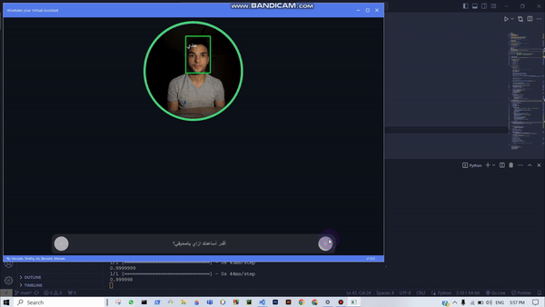
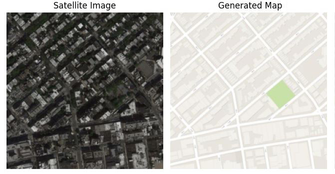
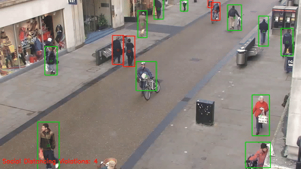

# 👋 Hi, I’m Ahmed Shafiq

# 💫 About Me:

🎯 Computer Vision Engineer | AI Enthusiast | Deep Learning Specialist
I'm a Computer Vision Engineer with over two years of experience in AI and deep learning. My work primarily focuses on building and optimizing computer vision models for real-world applications, specializing in tasks such as object detection, real-time video analysis, and edge deployment. I have hands-on experience with various AI frameworks and enjoy tackling complex challenges to create impactful solutions.

# 📂 Projects:
## [ACELYTICS (MMA - Tennis)](https://mvp.acelytics.ai/):

A computer vision-based tennis and MMA smart coach that extracts statistics and provides recommendations from match videos, using advanced techniques like TrackNet, custom-built CNNs, YOLO, image processing, and homography.

## [Hakeem - Virtual Assistant](https://github.com/ahmedshafiq12/Egyptian-Arabic-Virtual-Assistant):

Built a multi-modal assistant integrating computer vision, speech recognition, and NLP. Fine-tuned models for Egyptian dialect recognition and utilized Ccomputer Vision for emotion detection, enhancing user interaction through personalized responses.

## VisionStats (Graduation Project):

A tool to extract detailed game statistics, utilizing YOLOv3 for high-precision detection of players, ball, and goal, along with key statistics like distance covered, possession, shots, and passes.

## [License Plate Recognition System](https://github.com/ahmedshafiq12/License-Plate-Recognition-System):

Detects and reads license plates in video streams, associating detected plates with vehicles using a custom-trained model and PaddleOCR for content recognition.

## [GAN-Satellite-to-Map](https://github.com/ahmedshafiq12/GAN-Satellite-to-Map):

This project implements a Pix2Pix GAN using PyTorch to generate maps from satellite images.

## [Social Distancing Detector](https://github.com/ahmedshafiq12/Social-Distancing-Detector):

Implemented a YOLOv8-based system to monitor crowd behavior in real-time, measuring social distancing violations with customizable visualization settings.

📫 Connect with Me
Email: ahmed.mshafiq77@gmail.com

## 🌐 Socials:

# 💻 Tech Stack:
             
